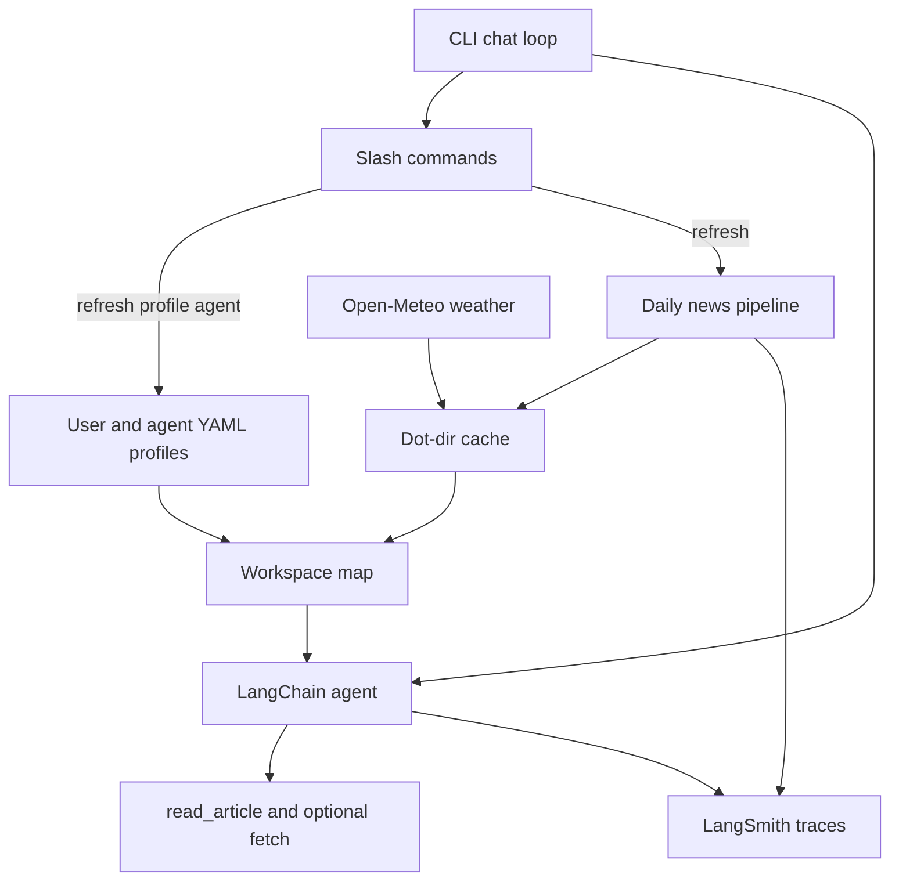

# The Daily Bubble — write `project.plan.md`

The only implementation step after approval is to create [`project.plan.md`](project.plan.md) at the repo root. It is the design artifact we will implement against later, and it should also serve as interview-prep (trade-offs, known unknowns, “one more day”).

## Product

**The Daily Bubble** is a general-purpose CLI assistant whose “bubble” is the user’s world: who they are, what they care about, what they do not, today’s weather, and a ranked index of news. It solves a real morning-loop problem (personalized briefing without doomscrolling) while staying demoable in a terminal.

The interesting innovation is **not** “an agent that can search.” It is a **workspace map**: a structured, regenerable context block injected into the system prompt so the model converses with a live index of the user’s day instead of stuffing full articles into context.

## Interview constraints to encode in the plan

Grafana’s assignment ([assignment.md](assignment.md)) wants a working end-to-end prototype, not production. The plan will explicitly time-box to ~3 hours, prefer a reliable demo over breadth, and call out:

- Clear context / prompt engineering (persona + workspace map)
- Tools (pipeline search/fetch + in-chat `read_article`)
- One interesting innovation (workspace map + interest/anti-interest LLM rerank + spoken blurbs)
- Observability via LangSmith (maps well to Grafana’s identity)

## Decisions already locked

- **Stack:** Python, LangChain `create_agent`, LangSmith tracing from day one
- **Model:** OpenAI frontier model (configurable; default `gpt-4.1` or `gpt-4o`), using Grafana-provided `OPENAI_API_KEY`
- **Search:** OpenAI built-in web search (no extra search key)
- **Weather:** Open-Meteo current + 4–7 day forecast (geocode location, no key)
- **Profiles:** multiple user profiles and multiple agent personas, switchable at runtime
- **User profile fields:** name, location, interests[], anti-interests[]
- **Persistence:** dot-directory in the home folder, e.g. `~/.the-daily-bubble/`
- **Rerank:** LLM structured scoring against interests and anti-interests; drop score `< 0`
- **Article index fields:** id, title, short spoken-aloud description, url, rerank score
- **Cache:** news refreshed once per calendar day; `/refresh` clears store and re-runs search
- **CLI:** interactive chat plus slash commands `/help`, `/refresh`, `/profile`, `/agent`

## Architecture to document



**Two loops, not one:**

1. **Ingest loop** (startup if cache is stale, or `/refresh`): search per interest → fetch pages → LLM rerank + spoken blurb → persist cache → rebuild workspace map.
2. **Chat loop:** general-purpose assistant with the workspace map in the system prompt. It surfaces news on prompts like “what’s new?”, “what’s up?”, “anything in the news?”. `read_article` loads full text only when needed.

This split is a deliberate cost/latency trade-off: interviewers get a snappy first message, and traces stay separable (pipeline run vs. conversation run).

## Data layout to specify in the plan

```text
~/.the-daily-bubble/
  config.yaml          # active_user, active_agent, model
  users/<id>.yaml      # name, location, interests, anti_interests
  agents/<id>.yaml     # name, persona prompt, speaking style
  cache/<user>/<date>/
    articles.json
    weather.json
```

Ship **seed profiles** in-repo (copied on first run) so the demo works without a setup wizard: at least two users and two agent personas.

Workspace map (XML or YAML block in the system prompt) contains: active agent name, user block, weather block, article index (not full bodies). Keep it compact so the model can point at article ids.

## Tools and ranking

**Pipeline (not necessarily exposed in chat):**

- `web_search(query)` — OpenAI web search, one query per interest (plus maybe a “local/top stories for {location}” query)
- `web_fetch(url)` — extract main article text (httpx + trafilatura or similar)
- `rerank_and_blurb(article, profile)` — structured LLM output: `{score, reason, spoken_description}`; drop `score < 0`

**Chat tools:**

- `read_article(article_id)` — load cached/fetched body into the conversation
- Optional thin `fetch_url` for follow-ups; mark as nice-to-have if time runs out

Rerank prompt will instruct: positive for interest overlap, negative for anti-interests, near-zero for off-topic. Spoken descriptions are 1–2 sentences, conversational, meant to be read aloud (voice briefing later; no TTS in v1).

## CLI and prompt behavior

- Entrypoint via `uv`/`typer`: `daily-bubble` starts the REPL
- Stream tokens; print tool calls so the demo is watchable
- `/profile [name]` and `/agent [name]` rebuild the workspace map (and system prompt) immediately; keep or reset history — plan will recommend **resetting the system message, keeping chat history** unless it becomes confusing
- News-trigger examples belong in the agent prompt, not hardcoded intent classifiers

## Observability (LangSmith)

- `LANGSMITH_TRACING=true` + project name `the-daily-bubble`
- Separate run names/tags: `ingest`, `rerank`, `chat`, plus metadata `user_id`, `agent_id`, article scores
- This is a talking point: treat the agent as an observable system, not a black box

## Proposed repo layout (for later implementation; listed in the plan)

```text
src/daily_bubble/
  cli.py
  agent.py
  prompts.py
  workspace.py
  profiles.py
  news/{search,fetch,rerank,cache}.py
  weather.py
  config.py
```

`uv` + `pyproject.toml`. Env: `OPENAI_API_KEY`, `LANGSMITH_API_KEY`, optional `OPENAI_MODEL`.

## What `project.plan.md` will contain

1. Mission and why this problem
2. Locked decisions
3. Architecture and data model
4. Prompt / workspace-map contract
5. Tool list
6. CLI contract
7. LangSmith plan
8. 3-hour build sequence (scaffold → profiles → ingest → weather → agent → CLI → traces)
9. Trade-offs, known unknowns, “one more day” (TTS, eval set, embeddings rerank, Grafana dashboard of traces)
10. Demo script for the 10-minute presentation

No application code, no `pyproject.toml`, no CLI in this step — only [`project.plan.md`](project.plan.md).
