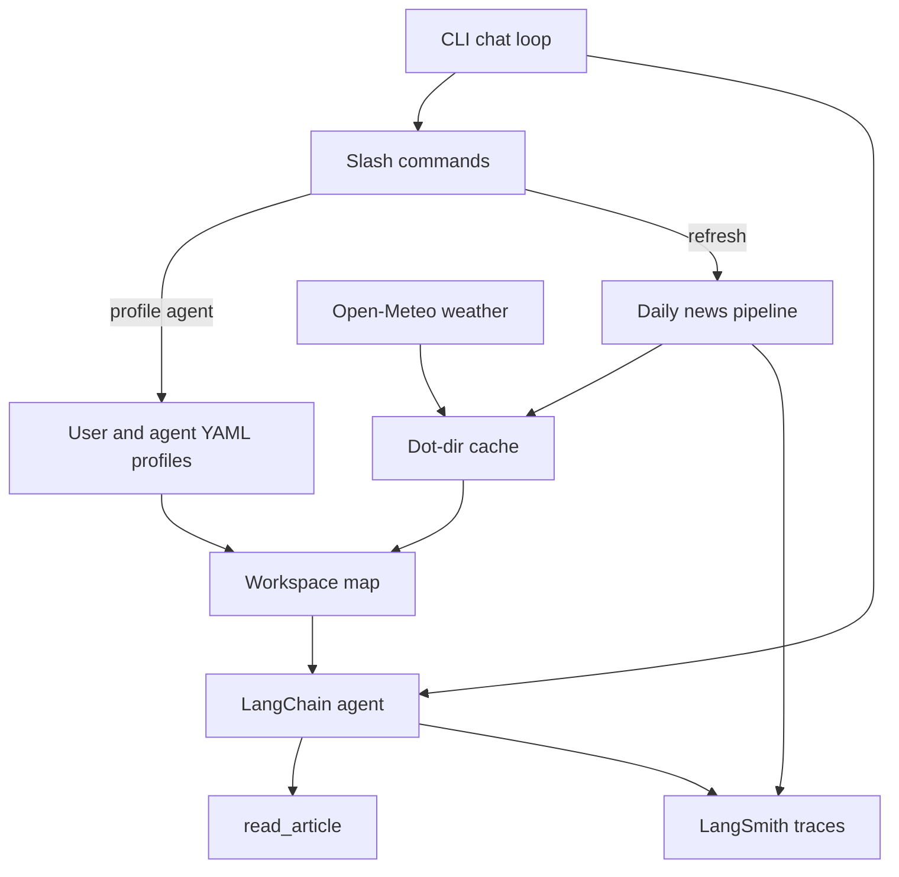

# The Daily Bubble

A time-boxed agentic LLM prototype for the Grafana Labs AI engineer take-home.

This document is the design artifact we will implement against. It is also interview prep: trade-offs, known unknowns, and what one more day would buy.

---

## 1. Mission

**The Daily Bubble** is a general-purpose CLI assistant whose "bubble" is the user's world: who they are, where they are, what they care about, what they do not, today's weather, and a ranked index of news.

It solves a real morning-loop problem — a personalized briefing without doomscrolling — while staying demoable in a terminal.

The interesting innovation is **not** "an agent that can search." Search is table stakes. The innovation is a **workspace map**: a structured, regenerable context block injected into the system prompt so the model converses with a live index of the user's day instead of stuffing full articles into context.

The agent remains a general-purpose assistant. News is something it can bring into the conversation — especially on prompts like "what's new?", "what's up?", "anything in the news?" — not a separate briefing mode.

Grafana's assignment asks for:

- Clear context and prompt engineering
- At least one tool
- Some other interesting innovation
- A working end-to-end prototype we can interact with in ~3 hours of build time

This plan is scoped to that bar. Production-readiness is explicitly out of scope.

---

## 2. Locked decisions

| Area | Decision |
| --- | --- |
| Language | Python 3.12+ |
| Agent framework | LangChain `create_agent` (LangGraph under the hood) |
| Observability | LangSmith tracing from day one |
| Model | OpenAI frontier model; default `gpt-4.1` (fallback `gpt-4o`); Grafana-provided `OPENAI_API_KEY` |
| Search | OpenAI built-in web search (no extra search API key) |
| Fetch | `httpx` + `trafilatura` (or similar) for main-article extraction |
| Weather | Open-Meteo current + 4–7 day forecast; geocode location via Open-Meteo geocoding; no API key |
| User profiles | Multiple; switchable at runtime. Fields: `name`, `location`, `interests[]`, `anti_interests[]` |
| Agent personas | Multiple; switchable at runtime. Fields: `name`, `persona` prompt, `speaking_style` |
| Persistence | Dot-directory in the home folder: `~/.the-daily-bubble/` |
| Rerank | LLM structured scoring against interests and anti-interests; drop score `< 0` |
| Article index | `id`, `title`, `spoken_description`, `url`, `score` (optional `reason`) |
| Spoken blurbs | 1–2 sentences, conversational, meant to be read aloud. No TTS in v1 |
| Cache | News and weather refresh once per calendar day; `/refresh` clears the store and re-runs ingest |
| CLI | Interactive chat plus slash commands `/help`, `/refresh`, `/profile`, `/agent` |
| Packaging | `uv` + `pyproject.toml`; entrypoint `daily-bubble` |
| Env | `OPENAI_API_KEY`, `LANGSMITH_API_KEY`, optional `OPENAI_MODEL`, `LANGSMITH_TRACING=true` |

---

## 3. Architecture

Two loops, not one. That split is the main cost/latency trade-off: interviewers get a snappy first message, and LangSmith traces stay separable (pipeline run vs. conversation run).



### Ingest loop

Runs at startup if today's cache is missing or stale, and on `/refresh`.

1. Load active user profile.
2. For each interest, run OpenAI web search. Optionally add one local/top-stories query for the user's location.
3. Deduplicate results by URL.
4. Fetch pages and extract main article text.
5. LLM rerank + spoken blurb against interests and anti-interests.
6. Drop any article with score `< 0`.
7. Persist `articles.json` and `weather.json` under `cache/<user>/<date>/`.
8. Rebuild the workspace map used by the chat agent.

### Chat loop

A general-purpose LangChain agent whose system prompt is: agent persona + workspace map.

- The workspace map holds an **index** of articles (not bodies).
- `read_article(article_id)` loads full text only when the conversation needs it.
- News-trigger examples live in the agent prompt. There is no hardcoded intent classifier for "what's new?"

### Why not one agent that searches live?

Live search on every "what's up?" would be slower, more expensive, less deterministic for a demo, and harder to inspect. Precomputing the bubble gives us a stable, ranked, spoken index we can point at in LangSmith and in the interview.

---

## 4. Data model

### On disk

```text
~/.the-daily-bubble/
  config.yaml              # active_user, active_agent, model
  users/<id>.yaml          # name, location, interests, anti_interests
  agents/<id>.yaml         # name, persona, speaking_style
  cache/<user>/<date>/
    articles.json
    weather.json
```

Date is local calendar date (`YYYY-MM-DD`). Startup treats cache as fresh if today's directory exists and both JSON files are present. `/refresh` deletes today's cache for the active user and re-runs ingest.

Ship **seed profiles** in-repo (e.g. `src/daily_bubble/defaults/`). Copy them into `~/.the-daily-bubble/` on first run so the demo works without a setup wizard. At least two users and two agent personas.

### User profile (`users/<id>.yaml`)

```yaml
id: rob
name: Rob
location: Denver, CO
interests:
  - local weather impacts
  - LLM / agent tooling
  - cycling
anti_interests:
  - celebrity gossip
  - sports betting
```

`location` is a human string. Weather code geocodes it to lat/lon via Open-Meteo.

### Agent persona (`agents/<id>.yaml`)

```yaml
id: bubble
name: Bubble
speaking_style: warm, concise, slightly wry; write as if speaking out loud
persona: |
  You are Bubble, a general-purpose assistant who also keeps a daily
  briefing of the user's world. You help with anything. When the user
  asks what's new, what's up, or anything in the news, use the workspace
  map. Do not dump headlines unprompted.
```

### Config (`config.yaml`)

```yaml
active_user: rob
active_agent: bubble
model: gpt-4.1
```

### Cached articles (`articles.json`)

```json
{
  "fetched_at": "2026-08-27T12:00:00-06:00",
  "user_id": "rob",
  "articles": [
    {
      "id": "a1",
      "title": "...",
      "url": "https://...",
      "score": 0.82,
      "reason": "Matches LLM tooling interest",
      "spoken_description": "One or two sentences meant to be spoken out loud.",
      "excerpt": "optional short extract from fetch",
      "body_path": "optional local path or inline body if small"
    }
  ]
}
```

Keep full bodies in the cache so `read_article` does not re-fetch during chat. If a body is large, store it beside the JSON (`bodies/<id>.txt`) rather than inlining everything.

### Cached weather (`weather.json`)

```json
{
  "fetched_at": "2026-08-27T12:00:00-06:00",
  "location": "Denver, CO",
  "latitude": 39.74,
  "longitude": -104.99,
  "current": {
    "summary": "Partly cloudy",
    "temp_f": 72,
    "wind_mph": 8
  },
  "forecast": [
    { "date": "2026-08-27", "high_f": 81, "low_f": 58, "summary": "Afternoon storms" }
  ]
}
```

Forecast length: today plus the next 4–7 days (Open-Meteo 7-day is fine; clip to 7).

---

## 5. Prompt / workspace-map contract

The system prompt has two parts, concatenated:

1. **Persona** — from the active agent YAML (`persona` + `speaking_style`).
2. **Workspace map** — a compact structured block rebuilt whenever profiles, cache, or active selection change.

Prefer XML (easy for the model to scan, easy for us to regenerate):

```xml
<workspace>
  <agent name="Bubble" />
  <user>
    <name>Rob</name>
    <location>Denver, CO</location>
    <interests>LLM / agent tooling; cycling</interests>
    <anti_interests>celebrity gossip; sports betting</anti_interests>
  </user>
  <weather location="Denver, CO">
    <today>Partly cloudy, 72F, afternoon storms likely. High 81 / low 58.</today>
    <forecast>
      Fri: ...
      Sat: ...
    </forecast>
  </weather>
  <articles>
    <article id="a1" score="0.82" url="https://...">
      <title>...</title>
      <spoken>One or two sentences meant to be spoken out loud.</spoken>
    </article>
  </articles>
</workspace>
```

Rules:

- **Index, not bodies.** The map must stay small enough that the model can point at ids. Full text is a tool call.
- **Scores stay visible** so the agent can prefer higher-ranked items when briefing.
- **Spoken copy is the briefing voice.** When surfacing news, prefer `spoken` over title-only dumps.
- **No hardcoded intent router.** The persona prompt tells the agent when to use the map (what's new / what's up / anything in the news / weather questions) and when to just be a general assistant.
- **Switching `/profile` or `/agent` rebuilds this block immediately.** Recommendation: replace the system message, **keep chat history**, unless the new persona makes prior turns confusing. If that happens in practice, reset history on persona switch only.

---

## 6. Tools

### Pipeline (ingest; not necessarily exposed in chat)

| Tool | Role |
| --- | --- |
| `web_search(query)` | OpenAI built-in web search. One query per interest, plus optional local/top-stories for `{location}`. Returns titles, URLs, snippets. |
| `web_fetch(url)` | HTTP GET + main-content extraction. Used during ingest and to populate cached bodies. |
| `rerank_and_blurb(article, profile)` | Structured LLM call. Output: `{score: float, reason: str, spoken_description: str}`. Drop `score < 0`. |

Rerank instructions:

- Positive score for overlap with `interests`.
- Negative score when `anti_interests` dominate.
- Near-zero for off-topic.
- Spoken description: 1–2 sentences, conversational, no headline-voice, no URL, no "as an AI".

Batch rerank if practical (one structured call over a list) to save latency. Per-article is the fallback if batch quality is poor.

### Chat tools

| Tool | Role |
| --- | --- |
| `read_article(article_id)` | Load cached body for an index id. This is the required in-conversation tool. |

Nice-to-have if time remains: a thin `fetch_url(url)` for follow-ups that are not in the index. Cut this first if the 3-hour budget slips.

Weather is **not** a chat tool in v1. It already lives in the workspace map. Re-fetch only happens on ingest / `/refresh`.

---

## 7. CLI contract

Entrypoint: `uv run daily-bubble` (Typer). Starts an interactive REPL.

### Startup

1. Ensure `~/.the-daily-bubble/` exists; seed defaults on first run.
2. Load `config.yaml` (active user + agent).
3. If today's cache is missing, run ingest (show a short progress line).
4. Build workspace map, construct agent, print a one-line ready banner (active user, agent, article count, weather one-liner).

### Chat

- Stream model tokens to the terminal.
- Print tool calls so the demo is watchable (`read_article a1` …).
- Use Rich (or equivalent) for readable output; do not block on a TUI framework.

### Slash commands

| Command | Behavior |
| --- | --- |
| `/help` | List commands and a one-line product reminder. |
| `/refresh` | Delete today's cache for the active user, re-run ingest, rebuild workspace map / system prompt. |
| `/profile` | List user profiles; mark the active one. |
| `/profile <id>` | Switch active user, persist to `config.yaml`, load that user's cache (ingest if needed), rebuild map. |
| `/agent` | List agent personas; mark the active one. |
| `/agent <id>` | Switch active agent, persist to `config.yaml`, rebuild system prompt. |
| `/quit` or `/exit` or EOF | Leave the REPL. |

Unknown `/...` input prints `/help`. Non-slash lines go to the agent.

---

## 8. LangSmith

Treat the agent as an observable system, not a black box. This is a talking point that maps to Grafana.

- `LANGSMITH_TRACING=true`
- Project name: `the-daily-bubble`
- Separate run names / tags so ingest and chat do not share one blob:

| Tag / run name | What it traces |
| --- | --- |
| `ingest` | Search + fetch fan-out |
| `rerank` | Structured scoring + spoken blurbs |
| `weather` | Geocode + forecast fetch |
| `chat` | Conversation turns and `read_article` |

Metadata on runs: `user_id`, `agent_id`, model name. On rerank runs, attach article scores (id → score) so we can open LangSmith and show *why* something dropped below zero.

If LangSmith is unset, the app still runs; tracing is best-effort. Document that in the README later.

---

## 9. Repo layout (implementation, not this step)

```text
the-daily-bubble/
  assignment.md
  project.plan.md          # this file
  README.md
  pyproject.toml
  .env.example
  src/daily_bubble/
    __init__.py
    cli.py                 # Typer REPL and slash commands
    agent.py               # create_agent, streaming, tool wiring
    prompts.py             # persona + news-trigger instructions
    workspace.py           # build XML/YAML workspace map
    profiles.py            # load/save users, agents, config; first-run seed
    config.py              # env, paths, model name
    weather.py             # Open-Meteo geocode + forecast
    news/
      search.py            # OpenAI web search
      fetch.py             # httpx + extraction
      rerank.py            # structured LLM score + spoken blurb
      cache.py             # daily cache read/write/invalidate
    defaults/
      users/
      agents/
```

Dependencies (expected): `langchain`, `langchain-openai`, `langsmith`, `openai`, `httpx`, `trafilatura`, `pydantic`, `typer`, `rich`, `pyyaml`, `python-dotenv`.

---

## 10. Three-hour build sequence

Priority is a reliable demo over breadth. Each phase should leave something runnable.

| Phase | Time | Outcome |
| --- | --- | --- |
| 1. Scaffold | ~20 min | `uv` project, `pyproject.toml`, `.env.example`, package layout, config paths |
| 2. Profiles | ~20 min | Seed users/agents, first-run copy to `~/.the-daily-bubble/`, load/switch helpers |
| 3. Weather | ~15 min | Geocode + current + 7-day forecast → `weather.json` |
| 4. Ingest | ~45 min | Search per interest, fetch, cache, dedupe |
| 5. Rerank | ~25 min | Structured scores, drop `< 0`, spoken blurbs |
| 6. Agent | ~30 min | Workspace map in system prompt, `read_article`, `create_agent` |
| 7. CLI | ~20 min | REPL, streaming, `/help` `/refresh` `/profile` `/agent` |
| 8. Traces | ~15 min | LangSmith project, tags, metadata; smoke the happy path |

Cut order if time slips: `fetch_url` chat tool, batch-rerank polish, extra seed profiles, pretty Rich tables.

Do **not** cut: workspace map, daily cache, `/refresh`, `read_article`, at least one user + one agent, LangSmith env wiring.

---

## 11. Trade-offs

**Precompute news vs. live search in the chat agent.** Precompute wins for demo latency, cost, and inspectability. The cost is staleness within a day, which `/refresh` covers.

**LLM rerank vs. embeddings / keyword overlap.** LLM rerank is slower and costs tokens, but it produces a `reason` and spoken blurb in one pass, which is better interview evidence than a cosine number. Embeddings are a "one more day" upgrade for cheaper daily ingest.

**Index + `read_article` vs. stuffing bodies into the prompt.** Index keeps the system prompt stable and small. The agent may brief from spoken descriptions without reading; it reads when the user digs in.

**OpenAI web search vs. Tavily / DuckDuckGo.** Interviewers have an OpenAI key. Extra keys add setup friction. We accept whatever citation shape OpenAI returns and normalize to `{title, url, snippet}`.

**Open-Meteo vs. OpenWeatherMap.** Zero extra keys. Geocoding quality for messy location strings is a known unknown; seed profiles will use well-known city names.

**YAML dot-directory vs. SQLite.** YAML is diffable, inspectable during the demo, and enough for a handful of profiles. No migrations.

**Keep chat history on persona switch.** Avoids feeling like a crash. If the new persona contradicts prior turns, we can reset later. Profile switch is more likely to need a fresh ingest than a history wipe.

**No TTS.** Spoken descriptions are the contract for a future voice briefing. Shipping TTS would burn the time-box on audio plumbing.

---

## 12. Known unknowns

- Exact OpenAI web-search response shape via LangChain vs. the Responses API, and how reliably we get fetchable URLs.
- Paywalled / JS-heavy pages: `trafilatura` will sometimes return empty; we should still keep title + snippet and let rerank work off that.
- Rerank calibration: what "below zero" looks like in practice; we may need a short instruction tweak after the first real run.
- Whether batch structured rerank degrades vs. per-article calls.
- Open-Meteo geocoding for neighborhoods vs. cities.
- LangChain `create_agent` system-prompt refresh: swap a new agent object on `/profile` and `/agent` rather than mutating a live graph if that's simpler.
- Token cost of daily ingest with a frontier model — fine for a demo, not for a product.

---

## 13. One more day

If the interview asks "what would you add?":

1. A tiny eval set: 10 articles × 2 profiles, assert drop/keep and blurb quality; log scores to LangSmith datasets.
2. Embedding rerank with LLM blurbs only for the top N, to cut ingest cost.
3. TTS (or a `--speak` flag) using the spoken descriptions we already generate.
4. A Grafana dashboard of LangSmith-exported traces: ingest latency, drop rate, `read_article` frequency.
5. User-editable interests from the CLI (`/interest +foo`, `/interest -bar`) persisted back to YAML.
6. `fetch_url` in chat for "tell me more about this thing that isn't in the index."
7. Tests around cache invalidation, score filtering, and workspace-map rendering.

---

## 14. Demo script (10 minutes)

Goal: they can type into the CLI before we talk trade-offs.

1. **Problem (1 min).** Morning briefing is either a firehose or a static digest. We want a general assistant that *has* a bubble: user, weather, ranked news with spoken copy.
2. **Show the workspace map (1 min).** Open a seed user YAML and today's `articles.json`. Point at score + `spoken_description`. Mention drop `< 0`.
3. **Run the CLI (4 min).**
   - Startup banner: user, agent, weather, article count.
   - "What's the weather look like?"
   - "What's new?" — agent uses spoken blurbs, not a URL dump.
   - "Read me the first one" — `read_article` visible in the trace/tool print.
   - `/agent <other>` — voice/persona changes.
   - `/profile <other>` — different interests, different index (ingest if needed).
   - `/refresh` only if we have time; otherwise describe it.
4. **LangSmith (2 min).** Open an `ingest`/`rerank` run and a `chat` run. Show tags, article scores, a dropped below-zero item if we have one.
5. **Trade-offs (2 min).** Two loops; index vs. bodies; OpenAI search to avoid extra keys; what one more day would be.

Bring: repo access, `.env` with OpenAI + LangSmith, a warm cache so startup is instant, and a backup clip or notes if the network blips.

---

## 15. Success bar

The prototype is done when all of the following are true:

- `uv run daily-bubble` starts a chat.
- A user profile and an agent persona load from `~/.the-daily-bubble/`.
- Today's weather and a filtered article index appear in the workspace map.
- The agent can brief from that index and `read_article` on request.
- `/refresh`, `/profile`, `/agent`, and `/help` work.
- LangSmith receives traces when keys are set.

That is the whole v1. Everything else is "one more day."
